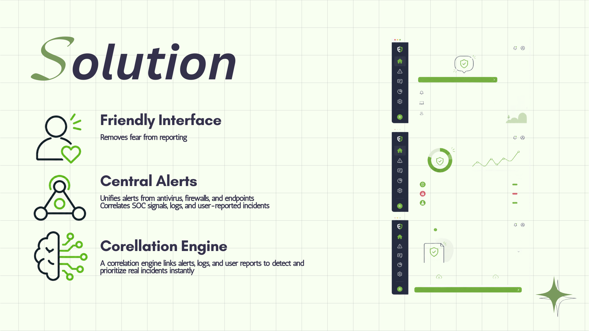

# ALTREON — Rapid Cyber Triage & SOAR Platform

<p align="center">
  
</p>

**ALTREON** is an AI-powered cybersecurity incident triage and SOAR (Security Orchestration, Automation and Response) MVP. It bridges the gap between panicked employees and overwhelmed IT admins by correlating human-reported fears with machine-generated alerts, automating triage, and maintaining an immutable audit trail compliant with **Algeria's Law 18-07** on data privacy.

---

## Table of Contents

- [Problem & Solution](#problem--solution)
- [Architecture](#architecture)
- [Tech Stack](#tech-stack)
- [System Design](#system-design)
- [API Endpoints](#api-endpoints)
- [Quick Start](#quick-start)
- [Testing](#testing)
- [Compliance](#compliance)
- [Project Structure](#project-structure)

---

## Problem & Solution

<p align="center">
  
</p>

<p align="center">
  
</p>

### The Problem
SMEs face a critical security gap: employees don't report incidents due to fear and confusion, while IT teams are flooded with alerts. This creates a **silence problem** where threats go unnoticed until it's too late.

### The ALTREON Solution
- **AI-guided employee reporting** — interactive chat that feels like a conversation, not a form
- **Automated correlation** — matches user reports with system alerts (EDR, firewalls, AV)
- **Smart escalation** — Twilio SMS alerts for critical threats
- **Immutable audit trail** — full Law 18-07 compliance

---

## Architecture

<p align="center">
  
</p>

The system follows a **4-step pipeline**:

1. **Input & Intake** — receives reports from employees (via AI chat) and automated tools (EDR, firewalls, AV) via the `/report` endpoint
2. **AI Processing & Correlation** — the AI engine analyzes reports, checks historical data for matching IPs within 24h, and auto-escalates correlated attacks to CRITICAL severity
3. **Routing & Action** — the Cybersec team assigns action tasks (isolate machine, reset credentials) and generates the final admin report
4. **Immutable Audit Logging** — every event is recorded in a tamper-proof SQLite database with no PUT/PATCH/DELETE endpoints

<p align="center">
  
</p>

---

## Tech Stack

<p align="center">
  
</p>

| Layer | Technology |
|:------|:-----------|
| **Backend** | Python, FastAPI |
| **Database** | SQLite + SQLAlchemy (immutable configuration) |
| **AI Engine** | DeepSeek V4, GLM-4, MiniMax, or any OpenAI-compatible open-source model |
| **Notifications** | Twilio SDK (SMS escalation) |
| **Testing** | Postman MCP (all endpoints verified) |

---

## System Design

<p align="center">
  
</p>

<p align="center">
  
</p>

---

## API Endpoints

### Employee AI Chat
```
POST /employee/chat
```
Interactive AI agent. The employee chats with the AI, which replies with questions and multiple-choice options.

### Automated Webhook
```
POST /webhook/auto
```
Direct ingestion for third-party security tools.

### Incident Intake
```
POST /report
```
Receives finalized reports (user or auto).

### AI Processing
```
POST /ai/process
```
Triggers AI correlation engine — searches historical logs (same IP, 24h window), generates summary.

### Action Routing
```
POST /route
```
Cybersec team assigns tasks and finalizes admin report.

### Retrieval Endpoints
| Method | Endpoint | Description |
|:-------|:---------|:------------|
| GET | `/incident/{id}` | Full incident details |
| GET | `/reports/employee/{name}` | All reports by employee |
| GET | `/reports/cybersec/pending` | Pending Cybersec routing |
| GET | `/reports/admin/all` | Master incident list |

---

## Quick Start

```bash
# 1. Backend setup
cd backend
python -m venv venv
venv\Scripts\activate    # Windows
pip install -r requirements.txt

# 2. Configure environment
copy .env.example .env   # Windows
# Edit .env with your API keys

# 3. Start the server
python run.py
```

The API will be available at `http://localhost:8000`.  
Interactive docs at `http://localhost:8000/docs`.

---

## Testing

<p align="center">
  
</p>

The included `test_api.py` runs a full end-to-end flow:

```bash
cd backend
python test_api.py
```

Or use the **Postman** collection to test all 5 endpoints in sequence:
1. Submit User Report -> 2. Submit Auto Report -> 3. AI Processing -> 4. Route -> 5. Fetch Final Incident

---

## Compliance

<p align="center">
  
</p>

ALTREON is designed for **Algeria's Law 18-07** on personal data protection:

- **No PUT/PATCH/DELETE endpoints** — once a log is written, it cannot be modified or deleted
- **Immutable audit trail** in `compliance_logs.db`
- **Tamper-proof forensic artifacts** — every action is timestamped and attributed (user, AI, system, or admin)

---

## Project Structure

```
ALTREON/
├── backend/
│   ├── app/
│   │   ├── __init__.py
│   │   └── main.py           # FastAPI application & all endpoints
│   ├── .env.example           # Environment template
│   ├── README.md              # Backend-specific docs
│   ├── requirements.txt       # Python dependencies
│   ├── run.py                 # Server entry point
│   └── test_api.py            # End-to-end test script
├── Pics/                      # Presentation assets
│   ├── Architecture Overview.png
│   ├── How does Altreon solve this.png
│   ├── Legal shield.png
│   ├── Logo.png
│   ├── Logs table.png
│   ├── Monitoring Interface.png
│   ├── Reporting Interface.png
│   ├── Solution.png
│   ├── System Design.png
│   └── Tech Stack.png
├── .gitignore
└── README.md
```

---

> Open-source AI-powered cybersecurity triage for SMEs.
